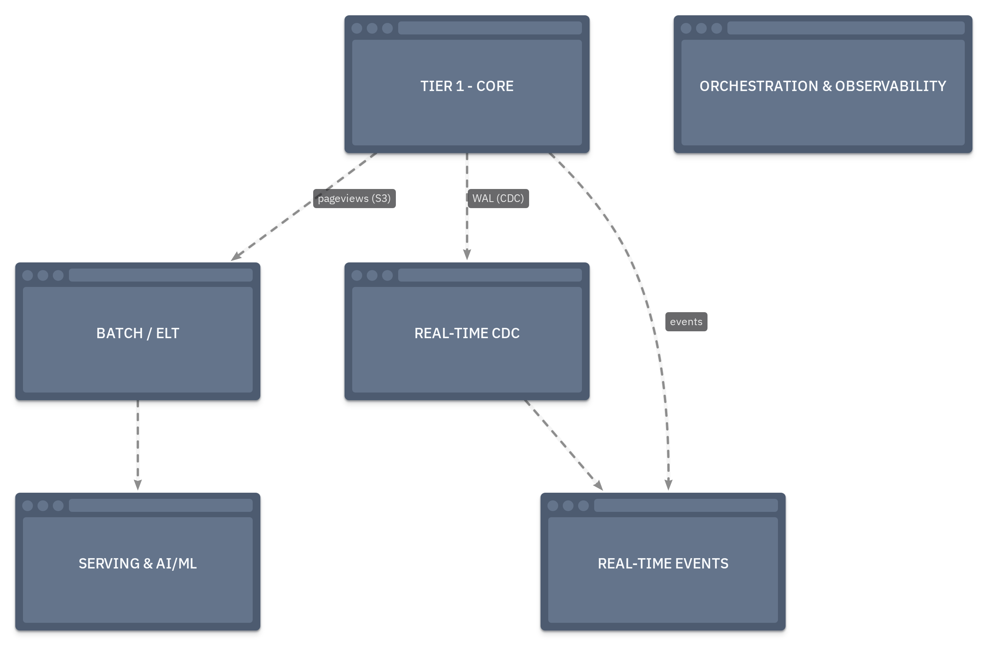
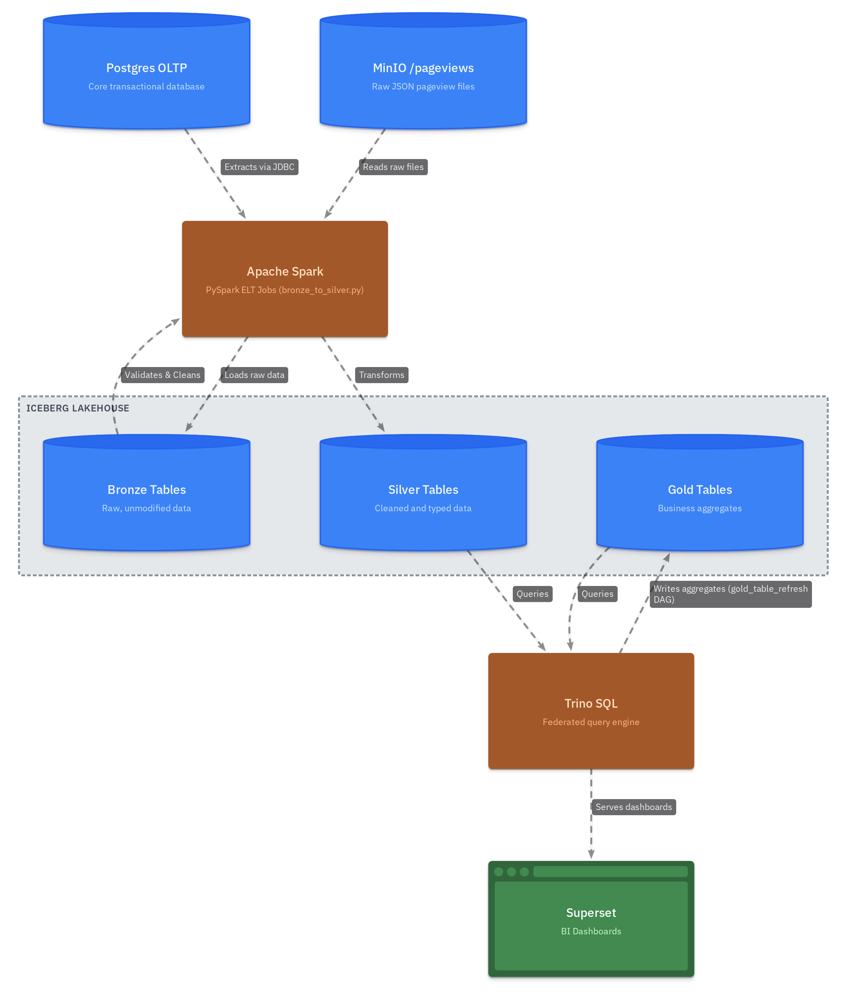

# Architecture

A deep-dive into how the OneShop platform is designed, why each technology was chosen, and how data flows between layers.

---

## Platform Layers



---

## Layer-by-Layer Breakdown

### Tier 1 — Always-On Core

These services run in every configuration (`make up-core`):

| Service | Image | Role |
|:--------|:------|:-----|
| **Postgres** | `debezium/postgres:15` | OLTP source with WAL logical replication pre-configured for Debezium |
| **Kafka** | `apache/kafka:3.8.1` | Event backbone in KRaft mode — no Zookeeper dependency |
| **Schema Registry** | `confluentinc/cp-schema-registry` | Enforces Avro schemas on Kafka topics; prevents silent contract breaks |
| **MinIO** | `minio/minio` | S3-compatible object store; stores raw pageview files and Iceberg data files |
| **mc** | `minio/mc` | One-shot init container; creates buckets on first boot |
| **Iceberg REST Catalog** | `tabulario/iceberg-rest` | Metadata catalog for Iceberg tables; decouples table discovery from compute |
| **MailHog** | `mailhog/mailhog` | Local SMTP sink; Alertmanager delivers alert emails here |

### Tier 2 — Batch Processing

Started with `make up-batch` or `make up-orchestration`:

| Service | Image | Role |
|:--------|:------|:-----|
| **Spark Master + Worker** | Custom `spark-lab` | PySpark ELT engine; reads Postgres + MinIO, writes Iceberg |
| **Spark Lab (Jupyter)** | Same image | Interactive notebook environment at `:8888` |
| **Airflow Webserver** | Custom Airflow 2.x | Web UI, REST API, DAG management |
| **Airflow Scheduler** | Same image | Executes DAG tasks, sends StatsD metrics |
| **Airflow DB** | `postgres:15` | Airflow metadata database (separate from OLTP) |
| **Trino** | `trinodb/trino` | Federated SQL over Iceberg, Postgres, MinIO |
| **Superset** | Custom `apache-superset` | BI dashboards connected to Trino |

### Tier 2 — Real-Time Processing

Started with `make up-realtime`. Three independent pipelines, all sharing Kafka as the backbone:

| Service | Image | Role |
|:--------|:------|:-----|
| **Kafka Connect** | Custom Debezium image | Hosts Debezium CDC source connectors and the OpenSearch sink connector |
| **ClickHouse** | `clickhouse/clickhouse-server:24.1` | Consumes `oneshop.public.purchases` directly via native Kafka Engine; MaterializedView pipes into MergeTree |
| **Streamlit Flash Sale** | Custom | Real-time dashboard reading from ClickHouse |
| **Flink JobManager** | Custom Flink 1.18 | Coordinates SQL jobs; native Prometheus reporter on `:9249` |
| **Flink TaskManager** | Same image | Executes the two streaming jobs (login enrichment + fraud detection) |
| **OpenSearch** | `opensearchproject/opensearch:2.11.0` | Full-text search index for the `items` catalog; populated by Kafka Connect sink |

### Tier 2 — ML & AI

Started with `make up-aiml`:

| Service | Role |
|:--------|:-----|
| **Flask Recommendation API** | Serves pre-trained ALS model predictions from Postgres at `:5050` |
| **Streamlit Semantic Search** | pgvector cosine similarity search over product embeddings at `:8502` |

### Tier 2 — Observability

Started with `make up-observability`:

| Service | Role |
|:--------|:-----|
| **Prometheus** | Scrapes 7 targets; stores all time-series metrics |
| **Grafana** | Dashboards for Kafka, Flink, ClickHouse, Airflow; auto-provisioned |
| **Alertmanager** | Routes alerts from Prometheus rules to MailHog |
| **kafka-exporter** | Exposes per-group consumer lag as Prometheus metrics |
| **statsd-exporter** | Receives Airflow UDP StatsD packets; bridges to Prometheus pull model |
| **JMX Prometheus Agent** | In-process JVM agent inside Kafka container; exposes broker JVM metrics |

---

## Airflow DAG Schedule

All six DAGs are event-driven or time-scheduled. The table below shows the trigger type and cadence for each.

| DAG | Trigger | Cadence | Business Purpose |
|:----|:--------|:--------|:----------------|
| `lakehouse_hydration` | Time-based | **Daily** | Load latest Postgres OLTP tables + pageview events into Bronze |
| `bronze_to_silver` | Dataset event | On Bronze update | Validate and clean Bronze → Silver; blocked by Great Expectations gate |
| `gold_table_refresh` | Dataset event | On Silver update | Aggregate Silver into Gold BI tables for Superset |
| `user_engagement_segments` | Dataset event | On Silver update | Compute RFV cohorts; export CSV to MinIO; email marketing team |
| `ml_training_pipeline` | Time-based | **Weekly** | Retrain ALS model + regenerate embeddings from latest Silver data |
| `iceberg_maintenance` | Time-based | **Weekly** | Compact small files, expire old snapshots, remove orphan data files |

!!! note "Dataset-driven scheduling"
    `bronze_to_silver`, `gold_table_refresh`, and `user_engagement_segments` use [Airflow Datasets](https://airflow.apache.org/docs/apache-airflow/stable/authoring-and-scheduling/datasets.html) to chain DAGs automatically. When `lakehouse_hydration` writes new Bronze data, it emits a Dataset event that triggers `bronze_to_silver` — no cron expression needed. The same cascade continues through to Gold and the marketing export.

---

## Data Flows

### ELT Pipeline (Batch)



**Why ELT, not ETL?**  
Data lands in Bronze in its raw, unmodified form (Extract → Load). Transformation happens *after* the load, in Silver and Gold (Transform). This is the defining characteristic of ELT and the medallion pattern — you never discard raw data. If a downstream bug corrupts Silver, you can re-derive it from Bronze without re-extracting from the source.

### Real-Time Pipelines (Three independent streams)

All three pipelines share the Kafka backbone but are completely independent — each can run without the others.

**Pipeline 1 — CDC Items → OpenSearch (inventory search)**

> **Business driver:** Product catalog updates (stock changes, price edits) need to be reflected in the customer-facing search index within seconds, not hours. Stale stock counts erode customer trust.

```
Postgres WAL (items table)
    │
    ▼ Debezium (oneshop-postgres-items-connector)
Kafka topic: oneshop.public.items
    │
    ▼ Kafka Connect (oneshop-opensearch-sink-connector)
OpenSearch index: items
    └──▶ full-text product search API
```

**Pipeline 2 — CDC Purchases → ClickHouse (flash sale analytics)**

> **Business driver:** Marketing runs flash sale campaigns lasting 2–4 hours. The team needs a live dashboard showing revenue-per-item and purchase velocity with <3-second data freshness. Hourly batch reports can't serve this use case.

```
Postgres WAL (purchases table)
    │
    ▼ Debezium (oneshop-postgres-purchases-connector)
Kafka topic: oneshop.public.purchases
    │
    ▼ ClickHouse Kafka Engine table: oneshop.purchases_raw
    │
    ▼ Materialized View (mv_purchases)
ClickHouse MergeTree table: oneshop.purchases
    └──▶ Streamlit Flash Sale dashboard (http://localhost:8501)
```

**Pipeline 3 — Login Events → Flink SQL (enrichment + fraud detection)**

> **Business driver:** Security needs to detect brute-force and multi-device login attacks within a 60-second window, not in next-day batch reports. Each Flink tumbling window closes every minute, so suspicious patterns are caught and alerted in near real-time.

```
Data Generator (make seed-logins)
    │
    ▼ Produces JSON events
Kafka topic: oneshop.logins
    │
    ├──▶ Flink Job 1: Login Enrichment
    │         LEFT JOIN users table (Postgres JDBC lookup)
    │         → Kafka topic: oneshop.enriched-logins
    │
    └──▶ Flink Job 2: Suspicious Login Detection (tumbling 1-min window)
              WHERE count > 5 AND distinct_devices > 2
              → Kafka topic: oneshop.login-alerts
```

### ML Pipeline

> **Business driver:** Product recommendations are currently generic. The data team wants personalised item suggestions to improve purchase conversion. ALS collaborative filtering uses implicit purchase signals (what users bought) rather than explicit ratings. Weekly retraining keeps recommendations fresh as purchase patterns shift.

```
Iceberg Silver (purchases + reviews)
    │
    ▼ Spark (compute_features.py)
Postgres user_features table
    │
    ▼ Spark MLlib ALS (train_als.py)        ◄─ Airflow @weekly
Postgres user_recommendations table
    │
    ▼ Flask REST API (:5050)

Postgres reviews (text)
    │
    ▼ sentence-transformers (offline, Airflow @weekly)
pgvector embeddings in Postgres
    │
    ▼ Streamlit Semantic Search (:8502)
```

---

## Key Engineering Decisions

| Decision | What was chosen | Why | Business Driver |
|:---------|:----------------|:----|:----------------|
| **KRaft Kafka** | Kafka without Zookeeper | Modern architecture — fewer moving parts, better for local dev | Reduces operational overhead for the data engineering team |
| **Debezium / Postgres image** | `debezium/postgres:15` | WAL logical replication enabled out of the box; no `postgresql.conf` patching needed | Fast CDC setup without touching production DB config |
| **Schema Registry** | Confluent CP Schema Registry | Enforces Avro contracts on every Kafka topic; prevents silent schema drift | Protects all downstream consumers from upstream schema changes |
| **Apache Iceberg** over Delta Lake / Hudi | Iceberg | Open standard; multi-engine (Spark + Trino + Flink read the same table); REST catalog decouples metadata from compute | Avoids vendor lock-in; analytics, ML, and BI all read one table |
| **Medallion Architecture** | Bronze → Silver → Gold | Raw data is never destroyed; each layer has a defined quality contract | Enables re-processing from Bronze if a transformation bug is found |
| **Airflow Dataset scheduling** | Dataset events instead of cron between DAGs | DAGs trigger only when upstream data actually changes, not on a fixed clock | No wasted Spark jobs when source data hasn't updated |
| **JMX Java Agent (not sidecar)** | `jmx_prometheus_javaagent` attached to Kafka JVM | In-process attachment gives full JVM metric access; a sidecar needs remote JMX which requires complex RMI auth | Zero-config metrics from Kafka without modifying the base image |
| **Named volume JAR delivery** | JAR downloaded into a named Docker volume on boot | Keeps the `apache/kafka` image unmodified; version bumps are a one-line URL change, zero image rebuild | Faster iteration; no custom image maintenance |
| **StatsD bridge for Airflow** | `statsd-exporter` container | Airflow is push/UDP; Prometheus is pull/HTTP — a statsd-exporter is the standard protocol adapter | Airflow task metrics appear in the same Grafana instance as all other services |
| **Flink native Prometheus reporter** | `metrics-prometheus` plugin shipped in Flink 1.18 | Zero additional containers or volumes needed; the plugin JAR is already in the image | Streaming job health visible in Grafana without extra infrastructure |
| **Modular Docker Compose** | 12-file include structure | Fine-grained startup (`make up-query`) without pulling in unneeded services; Makefile dependency chains encode functional relationships | Developers working on batch pipelines don't need to boot the Flink cluster |
| **Great Expectations** | GE checkpoint on Bronze layer | Automated data quality gate before transformation — catches bad source data early | Prevents corrupt data from silently breaking Gold BI reports and ML training |

---

## Modular Compose Architecture

The project uses Docker Compose's `include:` feature to split services across 12 files:

```
docker-compose.yml                    ← Core (always-on): Postgres, Kafka, MinIO, Iceberg, MailHog
docker-compose/
  docker-compose.orchestration.yml   ← Airflow (profile: orchestration, batch)
  docker-compose.compute.yml         ← Spark (profile: compute, batch)
  docker-compose.query.yml           ← Trino (profile: query, batch)
  docker-compose.bi.yml              ← Superset (profile: bi, batch)
  docker-compose.cdc.yml             ← Kafka Connect / Debezium (profile: cdc, realtime)
  docker-compose.streaming.yml       ← Flink (profile: stream-processing, realtime)
  docker-compose.olap.yml            ← ClickHouse + Streamlit (profile: olap, realtime)
  docker-compose.search.yml          ← OpenSearch (profile: search, realtime)
  docker-compose.aiml.yml            ← Flask + Streamlit Search (profile: ai-ml)
  docker-compose.observability.yml   ← Prometheus + Grafana + Alertmanager (profile: observability)
  docker-compose.devtools.yml        ← Redpanda Console (profile: devtools)
```

**Composite profiles** (`batch`, `realtime`) activate multiple fine-grained profiles at once. The Makefile dependency chain ensures correct startup order: `up-batch` depends on `up-core`, `up-bi` depends on `up-query`, etc.
