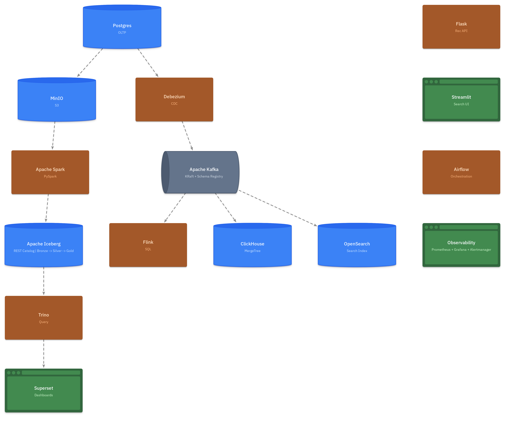

# OneShop Data Platform

<div class="hero-banner">
  <h1>🏪 OneShop Data Platform</h1>
  <p class="subtitle">
    A local reference implementation of production data engineering patterns, built on Apache open-source projects —
    batch, real-time streaming, and ML/AI pipelines on a single Lakehouse architecture.
  </p>
  <div class="hero-badges">
    <span class="hero-badge">Apache Kafka</span>
    <span class="hero-badge">Apache Spark</span>
    <span class="hero-badge">Apache Flink</span>
    <span class="hero-badge">Apache Airflow</span>
    <span class="hero-badge">Apache Iceberg</span>
    <span class="hero-badge">ClickHouse</span>
    <span class="hero-badge">Prometheus · Grafana</span>
  </div>
</div>

## What is this?

OneShop is a fictional e-commerce company used as a realistic domain for demonstrating a **complete, end-to-end data engineering platform**. Every service runs locally in Docker with a single `make` command — no cloud account required.

This project is a **unified implementation** of the ten data engineering pipelines described in the book *Practical Data Engineering with Apache Projects* (Dunith Danushka, Apress 2025). Where the book organises each pipeline as a standalone chapter project, this platform collapses them into one cohesive, modular system — sharing the same source database, Kafka backbone, and Iceberg Lakehouse across all modules.

---

## Why Was This Built? — The Business Problems

OneShop's management team identified a set of concrete data needs across three departments. Each platform module was designed to address one or more of those needs directly.

| # | Department | Business Problem | Platform Solution |
|:--|:-----------|:----------------|:-----------------|
| 1 | **IT / Data Engineering** | Raw data lives in two silos (Postgres OLTP + MinIO JSON events). Analysts have no single, reliable place to query it. | **Batch ELT + Iceberg Lakehouse** — medallion pipeline consolidates all sources into a queryable, audit-ready data lake |
| 2 | **Marketing** | Campaign attribution is manual and stale; teams can't tell which UTM channels drive traffic and which items convert. | **Gold BI tables + Superset dashboards** — pre-aggregated channel and conversion metrics served via Trino |
| 3 | **Marketing** | Flash sale campaigns run for 2–4 hours. Batch reports refreshing hourly are useless for real-time campaign decisions. | **CDC → ClickHouse → Streamlit** — sub-second purchase analytics streamed directly from Postgres WAL |
| 4 | **IT / Ops** | Any item update in Postgres (stock changes, price edits) takes hours to appear in the product search index. | **CDC → OpenSearch** — Debezium streams every `items` change to the search index within seconds |
| 5 | **Security** | Brute-force and multi-device login attacks are only detected in next-day batch reports — too late to act. | **Flink Anomaly Detection** — tumbling-window SQL job raises alerts within 60 seconds of suspicious activity |
| 6 | **Product / Growth** | Recommendations are generic (same items for everyone). The team needs personalised suggestions to increase conversion. | **ALS Recommendation Engine** — Spark MLlib collaborative filtering trained weekly on purchase history |
| 7 | **Customer Support** | Keyword search fails for discovery queries ("gift for a cook"). Support and product teams need semantic understanding. | **pgvector Semantic Search** — sentence-transformer embeddings enable natural-language product discovery |
| 8 | **IT / Ops** | No visibility into pipeline health across Kafka, Flink, Airflow, and ClickHouse without SSH-ing into containers. | **Prometheus + Grafana Observability** — unified dashboards and alert rules for all platform components |
| 9 | **Data Engineering** | Bad source data (nulls, type errors) silently corrupts Silver and Gold layers, breaking dashboards and ML models. | **Great Expectations quality gate** — automated validation blocks Silver transformation if Bronze data is invalid |

---

## Platform Coverage

<div class="card-grid">
  <div class="card">
    <div class="card-icon">🔄</div>
    <h4>CDC Ingestion</h4>
    <p>Debezium captures Postgres WAL changes into Kafka with Schema Registry enforcement.</p>
  </div>
  <div class="card">
    <div class="card-icon">🧊</div>
    <h4>Lakehouse</h4>
    <p>Apache Iceberg on MinIO (S3-compatible) with a REST catalog — time travel, schema evolution, multi-engine support.</p>
  </div>
  <div class="card">
    <div class="card-icon">⚡</div>
    <h4>Batch ELT</h4>
    <p>Spark-powered medallion pipeline: raw Bronze → clean Silver → aggregated Gold, orchestrated by Airflow.</p>
  </div>
  <div class="card">
    <div class="card-icon">🌊</div>
    <h4>Stream Processing</h4>
    <p>Flink SQL jobs for real-time login enrichment and anomaly detection on live Kafka streams.</p>
  </div>
  <div class="card">
    <div class="card-icon">📊</div>
    <h4>OLAP Analytics</h4>
    <p>ClickHouse for sub-second queries on CDC data. Superset dashboards on top of the Iceberg Gold layer via Trino.</p>
  </div>
  <div class="card">
    <div class="card-icon">🤖</div>
    <h4>ML & AI</h4>
    <p>ALS collaborative filtering + sentence-transformer embeddings served by Flask and Streamlit.</p>
  </div>
  <div class="card">
    <div class="card-icon">📈</div>
    <h4>Observability</h4>
    <p>Prometheus scrapes 7 targets. Grafana dashboards for Kafka, Flink, ClickHouse, and Airflow. Alertmanager → MailHog.</p>
  </div>
  <div class="card">
    <div class="card-icon">✅</div>
    <h4>Data Quality</h4>
    <p>Great Expectations validates the Bronze layer before Silver transformation begins.</p>
  </div>
</div>

---

## Quick Start

```bash
git clone https://github.com/Mohammed-Al-Zubiri/oneshop_data_platform.git
cd oneshop_data_platform
cp .env.example .env
make up-core       # Start Postgres, Kafka, MinIO, Iceberg Catalog, MailHog
make seed-batch    # Seed 100 users, 1000 items, 5000 purchases, 10K pageviews
```

Then pick a module:

=== "Batch"
    ```bash
    make up-batch      # Airflow + Spark + Trino + Superset
    make setup-batch   # Seed data + initialize Iceberg + unpause DAGs
    ```

=== "Real-Time"
    ```bash
    make up-realtime   # CDC + Flink + ClickHouse + OpenSearch
    make setup-realtime
    ```

=== "AI/ML"
    ```bash
    make up-aiml       # Flask Rec API + Streamlit Search
    make etl-features && make etl-train
    ```

=== "Observability"
    ```bash
    make up-observability  # Prometheus + Grafana + Alertmanager
    # Open http://localhost:3000  (admin / admin)
    ```

👉 See the [Getting Started](getting-started.md) guide for a full walkthrough.

---

## Architecture at a Glance



---

## Navigate the Docs

| Section | What you'll find |
|:--------|:----------------|
| [Getting Started](getting-started.md) | Prerequisites, first boot, verification steps |
| [Architecture](architecture.md) | Full design breakdown, engineering decisions, data flows |
| [Batch Pipeline](modules/batch.md) | Spark ELT, Airflow DAGs, Trino queries, Superset |
| [Real-Time Pipeline](modules/realtime.md) | CDC, Flink, ClickHouse, OpenSearch |
| [ML & AI](modules/ml.md) | ALS, embeddings, Flask API, Streamlit search |
| [Observability](modules/observability.md) | Prometheus, Grafana dashboards, alerts |
| [Data Model](data-model.md) | Postgres schema, Iceberg medallion tables |
| [Testing](testing.md) | Integration tests, CI, how to add tests |
| [Make Commands](reference/make-commands.md) | Full Makefile reference |
| [Service Endpoints](reference/service-endpoints.md) | All URLs and credentials |
