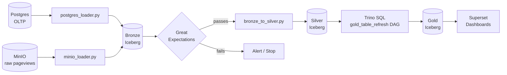

# Batch Pipeline

> [!NOTE]
> **Business Need:** The IT and Marketing departments need a reliable, unified view of OneShop's operational data for historical analysis, campaign attribution, and BI reporting. Data currently lives in two silos — a Postgres OLTP database and a MinIO data lake of raw JSON pageview events. Neither is queryable for analytics as-is. This pipeline consolidates them into a structured, audit-ready Iceberg Lakehouse and surfaces business KPIs through Superset dashboards.

The batch pipeline implements a **medallion ELT architecture** — data lands raw in Bronze, gets cleaned in Silver, and is aggregated into business-ready Gold tables. The entire lifecycle is orchestrated by Apache Airflow with event-driven DAG chaining.

---

## Starting the Stack

```bash
make up-batch      # Starts Airflow + Spark + Trino + Superset (and core)
make setup-batch   # Seeds Postgres (if empty) + initializes Iceberg + unpauses DAGs
```

`make setup-batch` is idempotent — if Postgres already has data it skips seeding. Safe to re-run.

---

## Services

| Service | URL | Credentials |
|:--------|:----|:------------|
| Airflow UI | [http://localhost:8082](http://localhost:8082) | admin / admin |
| Spark Notebooks | [http://localhost:8888](http://localhost:8888) | — |
| Trino | [http://localhost:9090](http://localhost:9090) | user: `test` |
| Superset | [http://localhost:8088](http://localhost:8088) | admin / admin |
| MinIO Console | [http://localhost:9001](http://localhost:9001) | admin / password |

---

## Pipeline Architecture



---

## Airflow DAGs

Six DAGs are deployed and managed by Airflow. They are paused on first boot and unpaused by `make setup-batch`.

!!! note "Event-driven chaining"
    DAGs in this pipeline use **Airflow Datasets** — instead of a fixed cron schedule, a DAG fires automatically when an upstream DAG declares it has written new data. This means `bronze_to_silver` only runs when `lakehouse_hydration` has actually produced new Bronze records, and `gold_table_refresh` only runs when Silver is freshly updated. No wasted Spark jobs on unchanged data.

### `lakehouse_hydration` — Schedule: Daily

**Purpose:** Loads the latest OLTP data from Postgres and the latest pageview events from MinIO into the Bronze Iceberg layer. This is the entry point of the entire batch pipeline.

| Task | Script | What it does |
|:-----|:-------|:-------------|
| `postgres_to_bronze` | `postgres_loader.py` | Reads all OLTP tables via Spark JDBC, writes to `bronze.users`, `bronze.items`, `bronze.purchases`, `bronze.reviews` |
| `minio_to_bronze` | `minio_loader.py` | Reads raw pageview JSON from MinIO, writes to `bronze.pageviews` |
| `notify_success` | Email | Sends confirmation to `admin@oneshop.com` on success |

**Trigger manually:**
```bash
make etl-trigger   # Triggers a DAG run immediately
```

---

### `bronze_to_silver` — Trigger: On Bronze Dataset update

**Purpose:** Reads Bronze tables, applies cleaning and type-casting, runs the Great Expectations quality gate, and writes validated data to Silver. This is the data quality checkpoint — if Bronze data is invalid, the Silver layer is never written to.

!!! important "Great Expectations gate"
    The first task in this DAG runs `validate_bronze.py`, which executes GE expectation suites against the Bronze tables. If **any** expectation fails (e.g., null `user_id`, invalid `amount` value), the task exits with status `FAILED` and the DAG stops immediately — `bronze_to_silver_transform` never runs. This prevents corrupt source data from poisoning downstream Gold tables and ML features.

| Silver Table | Source | Transformations |
|:-------------|:-------|:----------------|
| `silver.users` | `bronze.users` | Deduplicate, normalize email case, cast timestamps |
| `silver.items` | `bronze.items` | Deduplicate, cast numeric prices, normalize categories |
| `silver.purchases` | `bronze.purchases` | Deduplicate, validate referential integrity |
| `silver.reviews` | `bronze.reviews` | Deduplicate, clean text whitespace |
| `silver.pageviews` | `bronze.pageviews` | Parse JSON, extract UTM params into dedicated columns |

---

### `gold_table_refresh` — Trigger: On Silver Dataset update

**Purpose:** Runs Trino SQL to aggregate Silver data into Gold business tables, which are directly queried by Superset dashboards.

| Gold Table | Business Question It Answers |
|:-----------|:-----------------------------|
| `gold.top_selling_items` | Which items generated the most revenue in the last 30 days? |
| `gold.top_converting_items` | Which items have the best purchase-to-view conversion ratio? |
| `gold.sales_performance_24h` | How is hourly revenue trending over the last 24 hours? |
| `gold.pageviews_by_channel` | Which marketing channels (UTM sources) drive the most traffic? |

---

### `user_engagement_segments` — Trigger: On Silver Dataset update

**Purpose:** Segments all users by Recency, Frequency, and Value (RFV) into four cohorts: **Champions**, **At-Risk**, **New Users**, and **Inactive**. The segmented data is exported as a dated CSV to MinIO and emailed to the marketing team.

> **Business value:** Marketing uses these cohorts to target campaigns — Champions get loyalty offers, At-Risk users get win-back emails, Inactive users get re-engagement discounts. The CSV is delivered via a 7-day presigned MinIO URL, so the marketing team can download it without needing access to the data platform.

Writes results to `silver.user_engagement_segments` (Iceberg) and exports a dated CSV to the `customer-segments` MinIO bucket.

---

### `ml_training_pipeline` — Schedule: Weekly

**Purpose:** Retrains the ALS collaborative filtering model and regenerates pgvector sentence embeddings from the latest Silver data. See the [ML & AI guide](ml.md) for full details.

Runs every week so recommendations and embeddings stay current as purchasing patterns shift. Tasks:

1. `wait_for_silver_data` — PythonSensor that blocks until `silver.purchases_enriched` is non-empty
2. `compute_features` → Spark job that builds user/item feature vectors
3. `train_als_model` → Spark MLlib ALS training, stores top-N recs in Postgres
4. `generate_embeddings` → Runs the sentence-transformer embedding pipeline (parallel with ALS)

---

### `iceberg_maintenance` — Schedule: Weekly

**Purpose:** Keeps the Iceberg Lakehouse storage healthy over time. Without regular maintenance, small file accumulation degrades query performance and storage costs grow due to orphaned files and stale snapshots.

| Task | Iceberg Procedure | What it does |
|:-----|:------------------|:-------------|
| `check_bronze_data` | ShortCircuit guard | Skips maintenance if Bronze tables are empty |
| `compact_bronze_pageviews` | `rewrite_data_files` | Merges many small Parquet files into fewer, larger ones for faster scans |
| `expire_snapshots_bronze_pageviews` | `expire_snapshots` | Removes snapshot metadata older than 7 days, freeing MinIO storage |
| `remove_orphans_bronze_pageviews` | `remove_orphan_files` | Deletes data files no longer referenced by any snapshot |

---

## Running Spark Scripts Manually

You can bypass Airflow and run any Spark script directly:

```bash
make spark-submit SCRIPT=postgres_loader.py    # Load Bronze from Postgres
make spark-submit SCRIPT=minio_loader.py       # Load Bronze from MinIO
make spark-submit SCRIPT=bronze_to_silver.py   # Bronze → Silver
make spark-submit SCRIPT=compute_features.py   # Compute ML features
make spark-submit SCRIPT=train_als.py          # Train ALS model

make spark-shell   # Interactive PySpark REPL
```

---

## Iceberg Lakehouse Structure

The lakehouse is initialized by `make init-lakehouse` (called automatically by `setup-batch`).

```sql
-- Namespaces
CREATE NAMESPACE IF NOT EXISTS bronze;
CREATE NAMESPACE IF NOT EXISTS silver;
CREATE NAMESPACE IF NOT EXISTS gold;
```

Tables use `catalog = rest` (the Iceberg REST Catalog) and write data files to MinIO at `s3://warehouse/`.

---

## Querying with Trino

Connect any SQL client (DBeaver, DataGrip, `trino` CLI) to `localhost:9090` with user `test`, no password.

```sql
-- See all Iceberg namespaces
SHOW SCHEMAS FROM iceberg;

-- Browse Gold tables
SELECT * FROM iceberg.gold.top_selling_items LIMIT 20;
SELECT * FROM iceberg.gold.sales_performance_24h ORDER BY hour DESC LIMIT 48;

-- Iceberg time travel — query data as of a past snapshot
SELECT * FROM iceberg.silver.purchases
FOR TIMESTAMP AS OF TIMESTAMP '2024-01-15 10:00:00';

-- Federated query: join Iceberg Gold with live Postgres data
SELECT g.item_id, g.total_revenue, p.name
FROM iceberg.gold.top_selling_items g
JOIN postgres.public.items p ON g.item_id = p.id
ORDER BY g.total_revenue DESC;
```

---

## Superset Dashboards

Superset connects to Trino. After `make up-batch`:

1. Open [http://localhost:8088](http://localhost:8088) and log in (admin / admin)
2. Navigate to **Dashboards** — pre-built charts are available via Trino's Iceberg catalog
3. Use the SQL Lab (top menu) to explore Gold tables interactively

The Gold tables are designed to answer the marketing and IT department's primary KPI questions directly — no ad-hoc joins required at query time.
