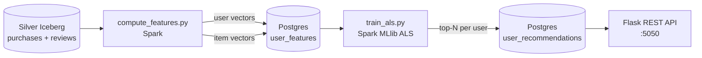
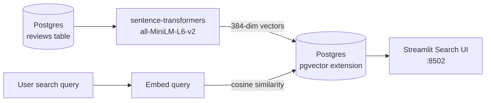

# ML & AI

> [!NOTE]
> **Business Need:** OneShop's product team identified two gaps. (1) Product recommendations are generic — every user sees the same "popular items" list regardless of their purchase history, which leaves conversion uplift on the table. (2) The keyword-based product search fails for discovery queries like *"birthday gift for someone who loves cooking"* or *"budget laptop for students"* — users either find nothing or browse aimlessly. These two pipelines address each gap independently: ALS for personalised recommendations, pgvector for semantic discovery.

The ML/AI tier adds two capabilities on top of the Lakehouse: **collaborative filtering recommendations** using Spark MLlib, and **semantic product search** using sentence-transformer embeddings stored in pgvector.

---

## Starting the Stack

```bash
make up-aiml        # Flask Rec API + Streamlit Semantic Search (includes core)
```

Model training requires Spark:

```bash
make up-compute     # Start Spark (if not already running)
make etl-features   # Step 1: Compute user/item feature vectors
make etl-train      # Step 2: Train ALS model and store recommendations
```

!!! important "Training prerequisite"
    `etl-features` and `etl-train` require **Silver Iceberg tables to be populated first**. Run the batch ELT pipeline (`make up-batch && make setup-batch`) or at minimum `make etl-trigger` and wait for the `lakehouse_hydration` DAG to complete before running these commands.

!!! important "Seed reviews before using semantic search"
    The Streamlit Semantic Search UI at [http://localhost:8502](http://localhost:8502) will show an empty results page until review embeddings are generated. Run:
    ```bash
    make seed-reviews                    # Default: 200 reviews
    make seed-reviews REVIEWS_COUNT=500  # Custom count
    ```
    This seeds Postgres with review records and generates their pgvector embeddings. The UI will return results immediately after.

!!! note "Automated retraining"
    The `ml_training_pipeline` Airflow DAG runs **every week** (`schedule="@weekly"`). It automatically retrains the ALS model and regenerates all embeddings from the latest Silver data — no manual `make etl-*` commands needed after the first run. You can also trigger it manually from the Airflow UI at [http://localhost:8082](http://localhost:8082).

---

## Services

| Service | URL | Notes |
|:--------|:----|:------|
| Flask Rec API | [http://localhost:5050](http://localhost:5050) | REST API for user recommendations |
| Streamlit Semantic Search | [http://localhost:8502](http://localhost:8502) | Semantic product search UI |
| Spark Lab | [http://localhost:8888](http://localhost:8888) | Jupyter notebooks for experimentation |

---

## Recommendation Engine (ALS)

### Why ALS?

Alternating Least Squares (ALS) is a matrix factorisation algorithm designed for **implicit feedback** datasets — situations where you have evidence of user interest (purchases, clicks, views) but no explicit ratings. OneShop's purchase history is exactly this kind of signal: a user buying an item is a strong implicit preference, even if they never rated it.

ALS decomposes the user-item interaction matrix into lower-dimensional latent factor vectors, then uses those vectors to predict the score a user would give to any item they haven't purchased yet. The top-N highest-scoring items become the personalised recommendations.

### Pipeline



### Feature Engineering (`compute_features.py`)

Reads from `silver.purchases` and `silver.reviews` via Spark and computes:

- **User features**: purchase frequency, average spend, category affinity
- **Item features**: purchase count, average rating, category popularity

Writes to Postgres `user_features` and `item_features` tables.

```bash
make etl-features
# Equivalent to:
make spark-submit SCRIPT=compute_features.py
```

### Model Training (`train_als.py`)

Uses **Spark MLlib's Alternating Least Squares (ALS)** algorithm:

| Parameter | Value | Rationale |
|:----------|:------|:----------|
| `rank` | 10 | Latent factor dimensions — balances expressiveness and compute cost at OneShop's scale |
| `maxIter` | 10 | Sufficient iterations for convergence on a dataset of ~5K purchases |
| `regParam` | 0.1 | L2 regularisation — reduces overfitting on users with sparse purchase history |
| `implicitPrefs` | `True` | Purchase data is implicit feedback (no explicit star rating) |
| `coldStartStrategy` | `drop` | New users or items with no history receive no prediction rather than a noisy score |

Top-N recommendations per user are written to `user_recommendations` in Postgres.

```bash
make etl-train
# Equivalent to:
make spark-submit SCRIPT=train_als.py
```

### Flask REST API

The Flask API reads from `user_recommendations` in Postgres and serves predictions over HTTP.

**Endpoints:**

```bash
# Health check
curl http://localhost:5050/health

# Get recommendations for user 42 (top 10 items)
curl "http://localhost:5050/recommend/42?n=10" | jq .

# Example response:
# {
#   "user_id": 42,
#   "recommendations": [
#     {"item_id": 103, "score": 0.94, "name": "Wireless Headphones"},
#     {"item_id": 217, "score": 0.89, "name": "Smart Watch"},
#     ...
#   ]
# }
```

---

## Semantic Search (pgvector + sentence-transformers)

### Why Semantic Search?

Traditional keyword search matches exact words. A query for *"noise cancelling headphones for travel"* only returns results if those exact words appear in a product name. Semantic search maps both the query and all product descriptions into a shared vector space — items that are *conceptually similar* are geometrically close, even if no words overlap.

This is essential for product discovery: users rarely know the exact product name they want, but they can describe what they need. Semantic search bridges that gap.

### Pipeline



### How It Works

1. **Offline (weekly via Airflow):** Product descriptions and reviews are embedded using `sentence-transformers/all-MiniLM-L6-v2`, producing 384-dimensional dense vectors
2. **Storage:** Vectors are stored in Postgres using the `pgvector` extension (`vector(384)` column type)
3. **Query time:** A user's search query is embedded with the same model, then Postgres runs an approximate nearest-neighbour search using cosine distance — returning the most semantically similar products

### Streamlit Search UI

Open [http://localhost:8502](http://localhost:8502). Enter a natural language query like:

- *"noise cancelling headphones for travel"*
- *"birthday gift for someone who loves cooking"*
- *"budget laptop for students"*

The UI returns the most semantically similar products — even if the exact words don't appear in the product name or review text.

---

## Notebooks

Interactive Spark notebooks are available at [http://localhost:8888](http://localhost:8888) (no password required). The `spark/notebooks/` directory is mounted into the container.

Useful for:

- Exploring Iceberg Silver tables with PySpark DataFrames
- Experimenting with different ALS hyperparameters (rank, maxIter, regParam)
- Visualising feature distributions before training
- Debugging recommendation quality for specific users
