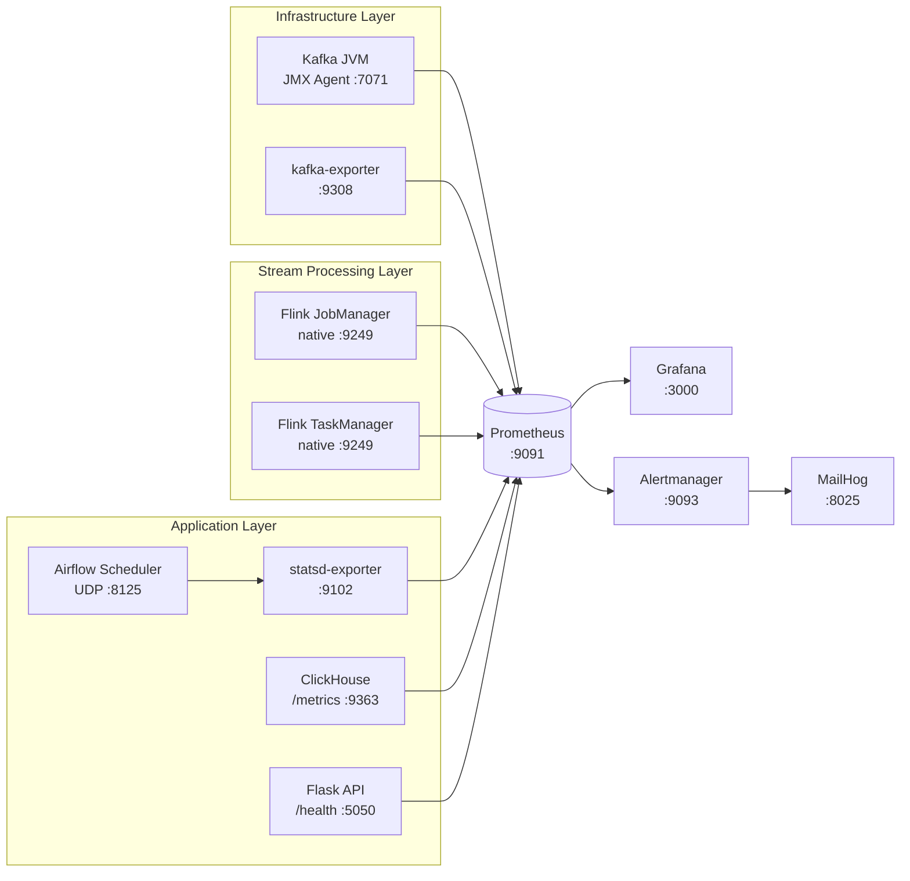
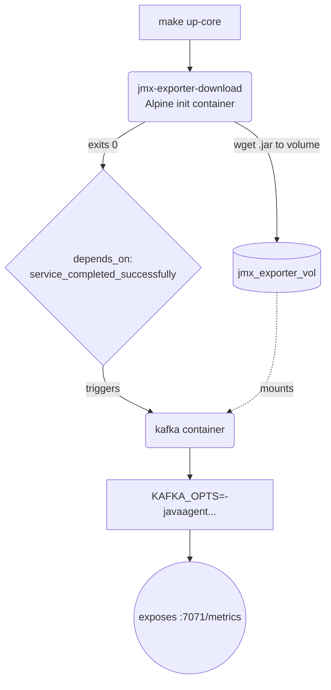

# Observability

> [!NOTE]
> **Business Need:** The data engineering team operates multiple pipeline types simultaneously — Kafka brokers, Flink streaming jobs, Airflow DAGs, and ClickHouse — each running in separate containers with no shared health view. Diagnosing a stalled pipeline currently means SSH-ing into containers and inspecting logs manually. This observability stack provides a single pane of glass across all platform components, with automated alerting so issues are surfaced before they impact downstream consumers.

The observability stack provides unified visibility across the entire platform — infrastructure health, queue backlogs, and application runtimes — all without modifying any core service image.

---

## Starting the Stack

```bash
make up-observability   # Prometheus + Grafana + Alertmanager + exporters (includes core)
```

| Service | URL | Credentials |
|:--------|:----|:------------|
| **Grafana** | [http://localhost:3000](http://localhost:3000) | admin / admin |
| **Prometheus** | [http://localhost:9091](http://localhost:9091) | — |
| **Alertmanager** | [http://localhost:9093](http://localhost:9093) | — |
| **MailHog** | [http://localhost:8025](http://localhost:8025) | — |
| StatsD Exporter | [http://localhost:9102/metrics](http://localhost:9102/metrics) | raw metrics |
| Kafka Exporter | [http://localhost:9308/metrics](http://localhost:9308/metrics) | raw metrics |

---

## Metrics Architecture

Three layers feed a single centralised Prometheus database:



---

## Scrape Targets

Open [http://localhost:9091/targets](http://localhost:9091/targets) — all jobs should show **State: UP**.

| Prometheus Job | Target | What It Captures |
|:---------------|:-------|:----------------|
| `kafka-jmx` | `kafka:7071/metrics` | Broker JVM heap, GC, bytes in/out, replica health, active controller |
| `kafka-lag` | `kafka-exporter:9308` | Per-consumer-group, per-partition lag delta |
| `flink-jobmanager` | `flink-jobmanager:9249` | Job status, checkpoint sizes, slot availability |
| `flink-taskmanager` | `flink-taskmanager:9249` | Operator throughput, backpressure, task latencies |
| `airflow` | `statsd-exporter:9102` | Scheduler heartbeats, task success/failure, pool utilisation |
| `clickhouse` | `clickhouse:9363` | Query latency, merge ops, memory tracking |
| `flask` | `flask-recommendation:5050/health` | Request counts, response times |

### JMX Agent Delivery Pattern

The Prometheus JMX agent JAR is delivered via a **named Docker volume** — keeping the `apache/kafka` image completely unmodified:

<div align="center">



</div>

To upgrade the JMX agent, change the version URL in `docker-compose.yml` — no image rebuild needed.

---

## Grafana Dashboards

All four dashboards are **auto-provisioned** on first boot from `monitoring/grafana/provisioning/dashboards/`. No manual import needed.

### Kafka Overview

Tracks broker health and consumer lag. Key panels:

| Panel | Metric | Alert on |
|:------|:-------|:---------|
| Active Controller Count | `kafka_controller_KafkaController_ActiveControllerCount` | Value ≠ 1 |
| Under-Replicated Partitions | `kafka_server_ReplicaManager_UnderReplicatedPartitions` | Value > 0 |
| Consumer Lag by Group | `kafka_consumergroup_lag` | Lag > 5000 and growing |
| Bytes In/Out | `kafka_server_BrokerTopicMetrics_BytesInPerSec` | — |

### Flink Overview

Monitors stream processing health:

| Panel | What it shows |
|:------|:-------------|
| Running Jobs | Number of active Flink jobs |
| Checkpoints | Last checkpoint duration and size |
| Backpressure | Whether any operator is backpressured (orange/red = problem) |
| Records In/Out per operator | Throughput per task |

### ClickHouse Overview

OLAP engine health:

| Panel | Metric |
|:------|:-------|
| Memory Usage | `ClickHouseMetrics_MemoryTracking` as % of OS total |
| Replication Lag | `ClickHouseAsyncMetrics_ReplicasMaxRelativeDelay` |
| Active Queries | `ClickHouseMetrics_Query` |
| Merge Operations | `ClickHouseMetrics_Merge` |

### Airflow Overview

Scheduler and task health (fed via StatsD → statsd-exporter):

| Panel | Metric |
|:------|:-------|
| DAG Bag Size | `airflow_dagbag_size` |
| Running Tasks | `airflow_executor_running_tasks` |
| Starving Tasks | `airflow_pool_starving_tasks` |
| Task Successes | `airflow_ti_successes` |
| Open Executor Slots | `airflow_executor_open_slots` |
| Scheduler Heartbeat | `airflow_scheduler_heartbeat` |
| DAG Parse Time | `airflow_dag_processing_total_parse_time` |
| Critical Section p99 | `airflow_scheduler_critical_section_duration{quantile="0.99"}` |

---

## Alert Rules

Alerts are defined in `monitoring/prometheus/alert.rules.yml` and route to Alertmanager → MailHog.

### Active Alert Rules

| Alert | Severity | Trigger Condition | For |
|:------|:---------|:------------------|:----|
| `KafkaUnderReplicatedPartitions` | 🔴 critical | `kafka_server_ReplicaManager_UnderReplicatedPartitions > 0` | 1m |
| `KafkaActiveControllerMissing` | 🔴 critical | `sum(ActiveControllerCount) != 1` | 1m |
| `HighConsumerLagGrowing` | 🟡 warning | Lag > 5000 **and** lag derivative > 0 over 5m window | 2m |
| `FlinkJobRestarting` | 🟡 warning | `increase(flink_jobmanager_job_numRestarts[5m]) > 0` | 1m |
| `ClickHouseReplicationLag` | 🔴 critical | Replication delay > 300 seconds | 5m |
| `ClickHouseHighMemoryUsage` | 🟡 warning | ClickHouse memory > 85% of OS total | 5m |

### Triggering a Test Alert

```bash
# Manually send a test alert through Alertmanager
curl -s -X POST http://localhost:9093/api/v1/alerts \
  -H 'Content-Type: application/json' \
  -d '[{
    "labels": {"alertname": "TestAlert", "severity": "warning"},
    "annotations": {"summary": "Manual test alert from docs"}
  }]'

# Open MailHog to see the email
open http://localhost:8025
```

### Alertmanager → MailHog Configuration

Alertmanager is configured in `monitoring/alertmanager/alertmanager.yml`. Alerts are routed to `localhost:1025` (MailHog's SMTP port, exposed inside the Docker network as `mailhog:1025`).

---

## Verifying the Stack

```bash
# Check each scrape target individually
curl -s http://localhost:7071/metrics  | grep kafka_controller_ActiveControllerCount
curl -s http://localhost:9308/metrics  | grep kafka_consumergroup_lag
curl -s http://localhost:9249/metrics  | grep flink_jobmanager
curl -s http://localhost:9102/metrics  | grep airflow_scheduler_heartbeat
curl -s http://localhost:9363/metrics  | grep ClickHouseMetrics_MemoryTracking

# All Prometheus targets status
curl -s http://localhost:9091/api/v1/targets | jq '.data.activeTargets[] | {job: .labels.job, health: .health}'
```

!!! tip "Observability without other modules"
    `make up-observability` works standalone — it will scrape whatever is currently running. If Flink isn't up, those targets simply show as DOWN in Prometheus. There's no error; the scrape gaps appear as empty series in Grafana.
