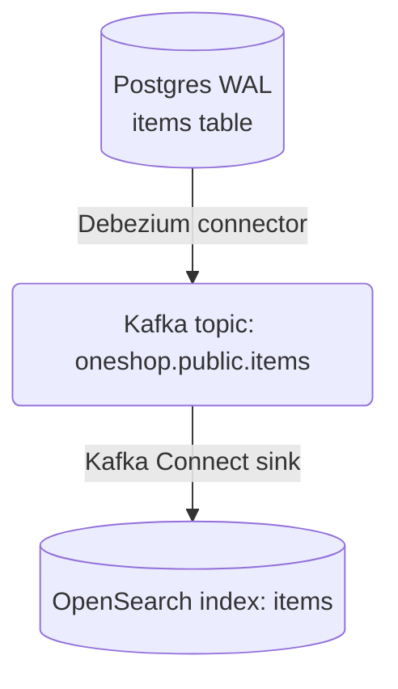
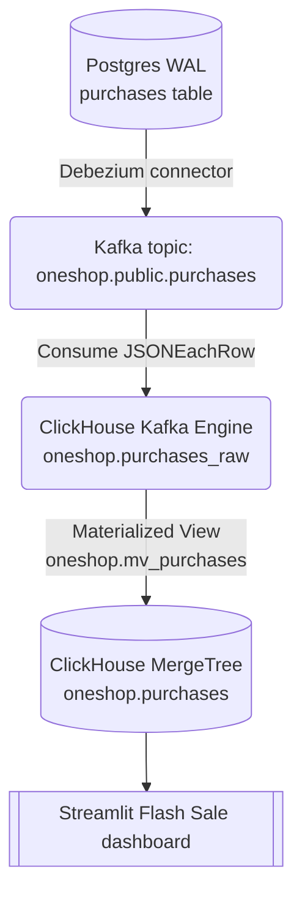
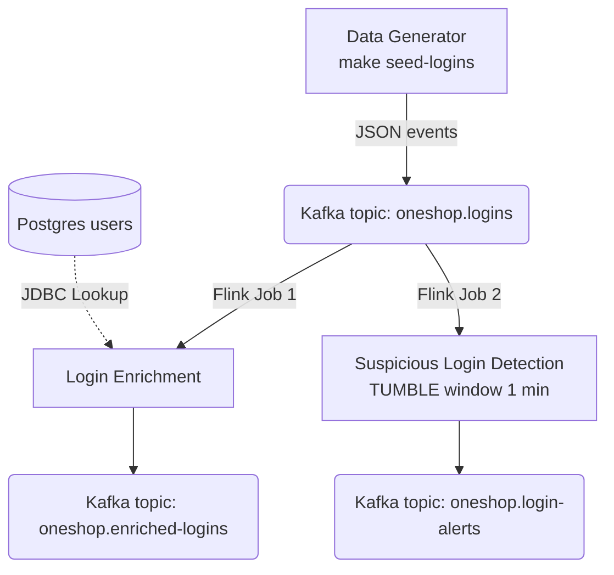

# Real-Time Pipeline

> [!NOTE]
> **Business Need:** Three separate real-time problems needed solving simultaneously. (1) Marketing runs flash sale campaigns lasting 2–4 hours and needs a live purchase dashboard with <3-second refresh — hourly batch reports are useless during an active sale. (2) Stock changes and price edits in Postgres need to appear in the customer-facing product search index within seconds, not hours. (3) Security needs to detect brute-force and multi-device login attacks within a 60-second window, not in next-day reports.

The real-time pipeline captures every database change as a Kafka event and fans it out to three downstream systems: **ClickHouse** for OLAP flash sale analytics, **OpenSearch** for full-text product search, and **Flink** for stream processing and anomaly detection.

---

## Starting the Stack

```bash
make up-realtime    # Starts CDC + Flink + ClickHouse + OpenSearch (and core)
make setup-realtime # Registers connectors + creates Flink tables + starts jobs
```

Or, if you want finer control:

```bash
make up-realtime
make setup-cdc     # Step 1: Register Debezium + OpenSearch connectors only
make setup-flink   # Step 2: Create Flink tables + start streaming jobs
```

---

## Services

| Service | URL | Notes |
|:--------|:----|:------|
| Redpanda Console | [http://localhost:8085](http://localhost:8085) | Kafka topic browser, consumer group lag |
| Flink Dashboard | [http://localhost:8084](http://localhost:8084) | Running jobs, checkpoints, backpressure |
| ClickHouse HTTP | [http://localhost:8123](http://localhost:8123) | Query interface (user: `default`, pass: `mysecret`) |
| Kafka Connect API | [http://localhost:8083](http://localhost:8083) | REST API for connector management |
| OpenSearch | [http://localhost:9200](http://localhost:9200) | REST API |
| Streamlit Flash Sale | [http://localhost:8501](http://localhost:8501) | Live CDC dashboard |

---

## Architecture — Three Independent Pipelines

All three pipelines share Kafka as the backbone but are **fully independent** — each can run without the others. A failure or restart in one pipeline has no impact on the other two.

**Pipeline 1 — CDC Items → OpenSearch**
<div align="center">



</div>

**Pipeline 2 — CDC Purchases → ClickHouse**
<div align="center">



</div>

**Pipeline 3 — Login Events → Flink SQL**
<div align="center">



</div>

---

## CDC Ingestion (Kafka Connect / Debezium)

### How It Works

Debezium reads Postgres's **Write-Ahead Log (WAL)** using logical replication (`pgoutput` plugin). Every `INSERT`, `UPDATE`, and `DELETE` on monitored tables is captured as a structured Kafka message. The `ExtractNewRecordState` transform unwraps the Debezium envelope so downstream consumers receive a clean, flat JSON record.

The `debezium/postgres` image has `wal_level = logical` pre-configured, so no manual `postgresql.conf` patching is needed.

### Connectors

Three connectors are registered by `make setup-cdc` (or `make connectors`):

| Connector name | Type | Source table | Kafka topic |
|:---------------|:-----|:-------------|:------------|
| `oneshop-postgres-items-connector` | Debezium source | `public.items` | `oneshop.public.items` |
| `oneshop-postgres-purchases-connector` | Debezium source | `public.purchases` | `oneshop.public.purchases` |
| `oneshop-opensearch-sink-connector` | OpenSearch sink | topic: `oneshop.public.items` | → OpenSearch `items` index |

**Check connector health:**
```bash
make connectors-status
# Or directly:
curl -s http://localhost:8083/connectors | jq .
curl -s http://localhost:8083/connectors/items-connector/status | jq .
```

### Simulating Live CDC Events

```bash
make seed-cdc       # Simulate 1000 item inventory updates (one-shot batch)
make seed-purchases # Stream 500 purchase events to Kafka in real-time
make seed-logins    # Stream 1000 login events to Kafka in real-time
```

Override defaults:
```bash
make seed-cdc CDC_COUNT=5000 CDC_INTERVAL=0.1       # Fast burst
make seed-purchases TX_COUNT=200 TX_INTERVAL=0.5    # Slow trickle
```

Watch events flow into Kafka in real-time at [http://localhost:8085](http://localhost:8085) (Redpanda Console).

---

## Flink Stream Processing

Flink processes **login events** (not CDC data). The input comes from the data generator (`make seed-logins`), which pushes JSON events directly to the `oneshop.logins` Kafka topic.

### Flink SQL Tables (create-tables.sql)

```sql
-- Source: login events from Kafka
CREATE TABLE login_events (
    user_id    INT,
    login_ts   STRING,
    ip_address STRING,
    device     STRING,
    is_success BOOLEAN,
    event_time AS TO_TIMESTAMP(login_ts),
    proctime   AS PROCTIME(),
    WATERMARK FOR event_time AS event_time - INTERVAL '5' SECOND
) WITH (
    'connector' = 'kafka',
    'topic'     = 'oneshop.logins',
    ...
);

-- Dimension: user profiles from Postgres (JDBC real-time lookup)
CREATE TABLE user_profiles (
    id         INT,
    first_name STRING,
    last_name  STRING,
    email      STRING,
    PRIMARY KEY (id) NOT ENFORCED
) WITH (
    'connector'  = 'jdbc',
    'url'        = 'jdbc:postgresql://postgres:5432/oneshop',
    'table-name' = 'users'
);

-- Sinks
CREATE TABLE enriched_logins (...)  -- topic: oneshop.enriched-logins
CREATE TABLE login_alerts (...)     -- topic: oneshop.login-alerts
```

### Streaming Jobs (insert-jobs.sql)

**Job 1 — Login Enrichment**

Joins every login event with the user's profile from Postgres in real-time (temporal join on processing time). This enriches raw login events (which only carry `user_id`) with human-readable context (email, full name) for downstream consumers and audit logs:

```sql
INSERT INTO enriched_logins
SELECT
    le.user_id,
    up.email                                AS user_email,
    CONCAT(up.first_name, ' ', up.last_name) AS full_name,
    le.login_ts, le.ip_address, le.device, le.is_success
FROM login_events AS le
LEFT JOIN user_profiles FOR SYSTEM_TIME AS OF le.proctime AS up
  ON le.user_id = up.id;
```

Output: `oneshop.enriched-logins` Kafka topic.

**Job 2 — Suspicious Login Detection**

Detects brute-force or multi-device attacks using a **1-minute tumbling window**. The detection criteria are:

- **`COUNT(*) > 5`** — more than 5 login attempts in a single minute indicates automated or brute-force behaviour
- **`COUNT(DISTINCT device) > 2`** — more than 2 distinct devices in one minute indicates a credential-stuffing attack or account takeover across multiple devices

Both conditions must be true simultaneously, which reduces false positives from users who simply use multiple devices normally:

```sql
INSERT INTO login_alerts
SELECT
    le.user_id,
    up.email AS user_email,
    TUMBLE_START(le.event_time, INTERVAL '1' MINUTE) AS window_start,
    TUMBLE_END(le.event_time, INTERVAL '1' MINUTE)   AS window_end,
    COUNT(*)                    AS login_count,
    COUNT(DISTINCT le.device)   AS distinct_devices,
    'SUSPICIOUS_MULTI_DEVICE'   AS alert_type
FROM login_events AS le
LEFT JOIN user_profiles FOR SYSTEM_TIME AS OF le.proctime AS up
  ON le.user_id = up.id
GROUP BY le.user_id, up.email, TUMBLE(le.event_time, INTERVAL '1' MINUTE)
HAVING COUNT(*) > 5 AND COUNT(DISTINCT le.device) > 2;
```

Output: `oneshop.login-alerts` Kafka topic.

**Monitor jobs:**
```bash
# View running Flink jobs
curl -s http://localhost:8084/jobs | jq .

# Or open the Flink Dashboard UI
open http://localhost:8084
```

---

## ClickHouse OLAP

ClickHouse ingests **CDC purchases** from Kafka using its native **Kafka Engine** table — no Kafka Connect sink needed. The pattern is:

1. **Kafka Engine table** (`oneshop.purchases_raw`) consumes `oneshop.public.purchases` — it reads on insert, cannot be queried directly
2. **Materialized View** (`oneshop.mv_purchases`) automatically pipes data from the Kafka Engine table into the MergeTree table
3. **MergeTree table** (`oneshop.purchases`) is what you query

### Table Schema

```sql
-- What ClickHouse actually stores (from clickhouse/init.sql)
CREATE TABLE oneshop.purchases (
    id             Int32,
    user_id        Int64,
    item_id        Int64,
    campaign_id    String,
    status         Int16,
    quantity       Int32,
    purchase_price Decimal(12, 2),
    deleted        Bool,
    created_at     DateTime64(6),
    updated_at     DateTime64(6)
) ENGINE = MergeTree()
ORDER BY (item_id, created_at);
```

### Useful Queries

```sql
-- Connect via HTTP: http://localhost:8123
-- user: default, password: mysecret

-- Recent purchase volume
SELECT count() AS purchases, sum(purchase_price) AS revenue
FROM oneshop.purchases
WHERE created_at > now() - INTERVAL 1 HOUR;

-- Purchase count by item, last 24 hours
SELECT item_id, count() AS purchases, sum(purchase_price) AS revenue
FROM oneshop.purchases
WHERE created_at > now() - INTERVAL 24 HOUR
GROUP BY item_id
ORDER BY revenue DESC;

-- Most recent CDC rows
SELECT * FROM oneshop.purchases ORDER BY updated_at DESC LIMIT 20;
```

The **Streamlit Flash Sale** dashboard at [http://localhost:8501](http://localhost:8501) auto-refreshes these queries every few seconds, giving the marketing team a live view of campaign performance.

---

## OpenSearch Full-Text Search

The OpenSearch sink connector keeps an `items` index in sync with Postgres via Kafka. Every item update in Postgres is reflected in OpenSearch within seconds — ensuring customers always see current stock levels and prices in search results.

```bash
# Search for items
curl -s "http://localhost:9200/items/_search?q=laptop&pretty" | jq '.hits.hits[].source.name'

# Check index stats
curl -s "http://localhost:9200/items/_stats" | jq '.indices.items.total.docs'
```
